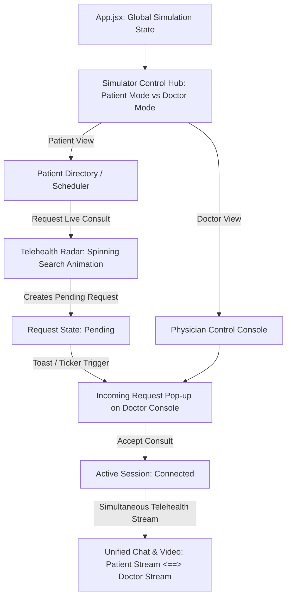

# Implementation Plan - Rapido-style Dual-Console Live Matching System

We will implement a **Rapido-style, real-time reactive simulation gateway** in **PulseFlow V1** where Patients and Doctors experience separate apps/dashboards that work simultaneously. 

By utilizing a **Shared Global Simulation State** and a **Floating Simulator Control Hub**, a single user can act as both the Patient and the Doctor, witnessing their actions trigger real-time, synchronized updates across both interfaces!

---

## User Review Required

> [!IMPORTANT]
> - **The "PulseFlow Simulator Control Hub"**: A floating, premium, glassmorphic widget displayed at the top/bottom of the page. It allows the user to switch instantly between **"🟢 Patient Console App"** and **"🛡️ Physician Console App"**. It also features a real-time system ticker log showing dispatches.
> - **Rapido-Style Live Matching**:
>   - In the **Patient App**, when scheduling an appointment, the patient can request a **"Live Telehealth Consult Now (Rapido Mode)"**.
>   - This dispatches their biometric intake (work details, elements exposure, symptoms) to the selected doctor.
>   - The Patient screen enters a **pulsating green Radar Matching screen**, waiting for the physician.
>   - A notification alerts the user: *'Incoming consult request for Dr. [Name]. Switch to Doctor View to accept.'*
> - **Real-Time Acceptance & Split Booth**:
>   - In the **Doctor App**, a glowing, pulsating incoming call invitation panel pops up with all patient biometrics.
>   - Accepting the call instantly connects both screens to the **Active Video Booth**!
>   - The user can switch views to chat as the patient and reply as the doctor in a unified session!

---

## 1. Architectural Changes & Shared State Flow

---

## Proposed Changes

### Component breakdown

#### [MODIFY] [App.jsx](file:///D:/PulseFlow_V1/src/App.jsx)
- **Shared States**:
  - `activeRequest`: Stores the active consult request `{ id, patientName, patientAge, symptoms, doctorId, status: 'pending' | 'accepted' | 'declined' }`.
  - `simulatorMode`: Tracks the active view (`'patient'` or `'doctor'`).
- **Control Bar Widget**: Add a gorgeous floating Glassmorphism control panel at the top of the app to switch roles and view system logs.
- **Onboarding Bypass**: Pre-configure a quick "Demo Login" button in Onboarding so users can immediately test the dual simulation.
- **State Synchronization**: Connect `Onboarding` handles so completing doctor onboarding registers them in the system, letting the user switch to their custom doctor console!

#### [MODIFY] [Scheduler.jsx](file:///D:/PulseFlow_V1/src/components/Scheduler.jsx)
- Expand the booking modal to offer two options:
  1. **"Instant Live Telehealth (Rapido Mode)"** ➜ Launches the live radar matching.
  2. **"Schedule Future Visit"** ➜ Yields the standard booking ticket.

#### [MODIFY] [Telehealth.jsx](file:///D:/PulseFlow_V1/src/components/Telehealth.jsx)
- Support **Dual Telehealth Feeds**:
  - If in Patient View: Displays Doctor's video stream, text chat sends message as patient.
  - If in Doctor View: Displays Patient's video stream, text chat sends message as doctor.
- Add a **Radar Matching Overlay** with a beautiful CSS rotating circular sweep for patients waiting in queue.

#### [MODIFY] [Dashboard.jsx](file:///D:/PulseFlow_V1/src/components/Dashboard.jsx)
- Adapt the Doctor's Dashboard to listen to `activeRequest` and render a high-fidelity **Pulsating Alert Chime panel** when a request is dispatched, letting the doctor accept or decline.

---

## Verification Plan

### Automated Tests
- Run `npm run build` to confirm zero bundler or compilation syntax errors.

### Manual Verification
1. Access the app and choose **Patient** profile.
2. Select **Symptom Analyst** and trigger an "Ocular Strain/Insomnia" assessment.
3. Head to **Consult Scheduler** and choose **Dr. Rajesh Sharma**.
4. Click "Schedule Session" and pick **"Instant Live Telehealth (Rapido Mode)"**.
5. Observe the Patient Telehealth tab transitioning to a gorgeous **Spinning Green Radar** matching screen.
6. Look at the Simulator Control Hub at the top indicating a pending request for Dr. Sharma.
7. Click **"Switch to Physician App"** in the Control Hub.
8. Observe the Doctor Console displaying a glowing, pulsating incoming call panel with patient Alex's biometrics and workplace exposures.
9. Click **"Accept Consultation"**.
10. Watch the Doctor Console instantly transition into the Live Video Booth!
11. Switch back to **"Patient App Mode"** and observe the Patient has also connected, and the call is live!
12. Swap back and forth, typing messages on both screens to test active chat routing.
